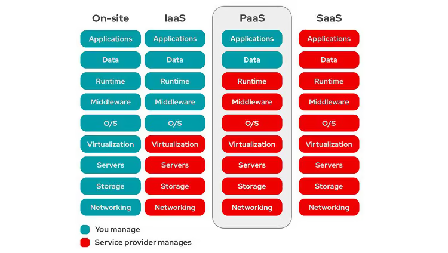

# Cloud Computing
 is the practice of using a network of remote servers (machines/computers) hosted on the internet to store, manage, and process data/information, rather than your local computer.

## Cloud Computing Types
#### IssS (Infrastructure as a Service)
Provides basic computing resources, such as virtual machines and storage

is internet access to 'raw' IT infrastructure—physical servers, virtual machines, storage, networking and firewalls—hosted by a cloud provider. IaaS eliminates cost and the work of owning, managing and maintaining on-premises infrastructure. With IaaS, the organization provides its own application platform and applications. 
- its pay-as-you-go model lets organization to pay only for the resources they use
- organizations have full control over their resources

#### PaaS (Platform as a Service)
PaaS delivers a platform that enables developers to build and deploy custom applications without managing the underlying infrastructure.

#### SaaS (Software as a Service)
Offers complete, ready-to-use applications. 
- offers lower cost of ownership
