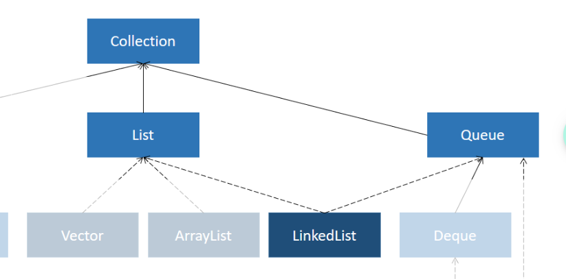

java, LinkedList
> best if elements are added, deleted in the middle of a list

# `LinkedList Class`

needs:

```java
import java.util.LinkedList;
```

## `LinkedList` methods
- same as `ArrayList`


```java


// create ArrayList
// only works with wrapper types not primitives
LinkedList<String> linkedList = new LinkedList<>();

// add element
// adds element to the end
linkedList.add("bob");
linkedList.addFirst("tim");
linkedList.addLast("bobek");

// modify element
linkedList.set(0, "bobek2");

// get element
String name = linkedList.get(1);
String name1 = linkedList.getFirst();
String name2 = linkedList.getLast();

// remove element
linkedList.remove(1);
linkedList.removeFirst();
linkedList.removeLast();


// size of array
int linkedListLength = linkedList.size();


// iterate over
for(String name : linkedList) {
  System.out.println(name);
}
OR
for(int i = 0; i < linkedList.size(); i++) {
  System.out.println(linkedList.get(i));
}


// sort
Collections.sort(linkedList);
Collections.reverse(linkedList);


// print
System.out.println(linkedList);

```
