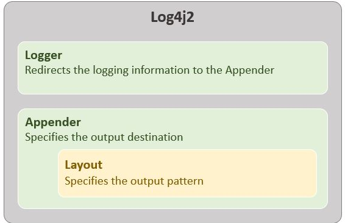

# Logging in Java

## Log4j2 Structure



- `Logger` accepts all the information to be logged and redirects it to teh Appender.

- The `Appender` specifies where the logging output should be stored.

- The `Layout` specifies the format of the logs.

## Logging Configuartion

Provided in `src/resources/log4j2.properties` file.

```bash
#Name of the Properties file
name=LoggerConfigFile
#Declaring logger
rootLogger.level=info
rootLogger.appenderRef.file.ref=LoggerAppender
# File Appender
appender.file.name=LoggerAppender
appender.file.type=File
appender.file.fileName=log/ErrorLog.log
#Logging Pattern
appender.file.layout.type=PatternLayout
appender.file.layout.pattern=%d{dd-MMM-yyyy HH:mm:ss} %level - %m%n
```

