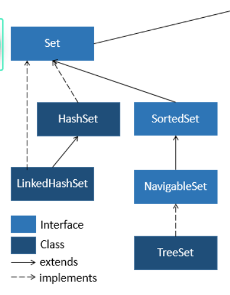

java, HashMap
# Set
- no duplicates
- automatically removes duplicates if same element is added twice
- if we want to use this feature to remove object with same content, we have to override the `equals()` and `hashCode()` methods of the object
- in `java.util`


Hierarchy:




## Set Classes

### HashSet

- unordered
- O(1) add, remove, contains
- one `null` element
- impplemented by using a `HashMap`
- uses the value returned by the `.hashCode()` method to determine where and how the object will be stored

### TreeSet
- elements are sorted according to their natural order 
- or by a `Comparator` provided at set creation
- O(logn) add, remove, contains
- implemented by used a tree structure (Red-Black tree)
- does not allow null elements if natural ordering is used


### LinkedHashSet
- elements are stored in insertion order


## Syntax
```java
// CREATE
// only works with wrapper types not primitives
HashSet<String> set = new HashSet<>();


// ADD ELEMENT
// returns false if the set already contianed the element true if it did not
set.add("TX");


// CHECK FOR ELEMENT
boolean hasElement = set.contains("TX");


// REMOVE ELEMENT
set.remove("GA");
// remove all elements
set.clear();


// SIZE
int setSize = set.size();


// ITERATE OVER
for(String element : set) {
    System.out.println(element);
}

// or with an iterator
Iterator<String> iterator = set.iterator();
while(iterator.hasNext()) {
    System.out.println(iterator.next());
}


// PRINT
System.out.println(set);


// ARRAY to SET
// string array
String[] arr1 = {"TX", "GA"};
HashSet<String> set1 = new HashSet<>(Arrays.asList(arr));
// or
HashSet<String> emptySet = new HashSet<>();
emptySet.addAll(arr1);

// with primitives
int[] arr2 = {3, 5, 6, 6};
HashSet<Integer> set2 = new HashSet<>(Arrays.stream(arr2).boxed().toList());


// SET TO ARRAY
int[] nums = {5, 8, 3, 4, 6};
Set<Integer> numset = new HashSet<>(Arrays.stream(nums).boxed().toList());
int[] newarr = numset.stream().mapToInt(i -> i).toArray();


```


