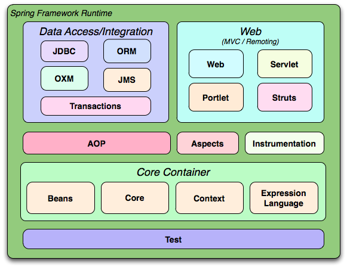

java, spring, bean

# [Spring](https://spring.io ) Concepts
Usually means the Spring Framwork.


## Spring Framework 

A Java framework used to develope Java applications.

Why:
- lets the developer concentrate on writing business logic
- lets us write an appliction using POJOs (Plain Old Java Objects) while Spring is managing the infrastructure and applies services to our POJOs (no need for application server for example)

Advatages:
- Convention over Configuration
- use of POJOs
<br>Spring framework helps developers to develop enterprise applications using POJO. An enterprise container like an application server is not required while using POJOs.
- Flexibility for configuring Spring: 
    - XML or
    - Java-based annotations.
- No need for Server
<br>Spring framework provides a lightweight container and it can be activated without any web server or application server.
- No need for reinvention
<br>Spring uses technologies such as JDK timers, ORM frameworks, Java EE, etc. So developers need not have to learn all those technologies or frameworks to develop applications.
- Modularity
- Ease of Testability
<br>Spring Dependency Injection simplifies the injection of test data by using JavaBean POJO.
- Inversion Control and APIs
<br>Spring framework provides inversion control and APIs to translate exceptions thrown by JDBC and Hibernate into unchecked and consistent.


### Spring Modules



#### Spring Core Module
- Provides the IoC Container
- IoC container is implemented by
    - BeanFactory or
    - ApplicationContext


>What is it? 

>What does it do for us?   

>How do we build a spring application? 


- main advantage: convention over configuration
- has multiple modules: Core, Data, Web
- Spring IoC container is used for handling objects(beans) and handling dependencies, it is implemented by:
    - ApplicationContext
    - BeanFactory


### Quick Terminology  

#### Spring Bean 
A class registered with the Spring Container

- they can be injected as a dependency

#### Spring/IoC Container 
 An object that instantiates (creates) and holds your Spring Beans, then injects them wherever they’re being called in the application.
#### Spring Module 
Parts of the Spring FrameWork
- required 
- optional


Know the required ones and some optional ones 
#### Spring Project 
Optional extention to the Spring Framwork.

#### Bean Wiring 

Bean Wiring is how we connect our beans as dependencies of one another.

<hr>
<hr>

## IoC: 
>What is Inversion of Control? 

>What control does Spring invert exactly? 

>What does the phrase convention over configuration mean in Spring? 

>Benefits and drawbacks of Spring’s opinionated tendencies? 

IoC is the act of taking control of some aspects of application away from the developer, and letting the Framework handle it instead. 

- the process of creating, initializing and managing the objects was initially a task for the developer.
- business logic is more important than the above tasks. So, this process is handled by spring IoC( Inversion of control ) through dependency injection


## Dependency Injection: 

>What is it? 

>What are the types? 

>What does Spring use? 

>Why is field injection bad? (Breaks encapsulation - ignores OOP getters/setters/private) 

 Injecting objects into other objects is called Dependency Injection.

 ### Types of Dependency Injections:
-  `Constructor Injection` - This sets dependencies using a Class’s constructor so that the injection happens at the same time as Class instantiation. 

- `Setter Injection` - uses the setter method of a Class to add the dependencies slightly after instantiation (after the constructor is invoked) 

- `Field Injection`
    - inject dependencies in the variable declarations
    - bad practice !!!
    - breaks encapsulation

## Spring Beans

Java Classes managed by the Spring  to be used for dependency injections.


### How to define a Bean


#### 1. with Stereotype annotations
- are used to create beans automatically in the application context
- types:
    - `@Component` - most common: generic annotation to make a class a bean
    - `@Repository` - used for DAO classes
    - `@Service` - used for service classes
    - `@Controller` - used for controller classes
#### 2. Configuration Java Class
#### 3. XML Configuration
- via the <bean> tag


## Bean Wiring

Bean Wiring is how we connect our beans as dependencies of one another.

- When you need to access an other class's method like a Service Class calls a DAO Class method, you use dependecy injection to establish a connection between them.
- Types
    - Constructor Injection
    - Setter Injection
    - Field Injection (DO NOT USE)

 


## Spring (IOC) Containers

>What are they? 

>What are your two options? (BF vs AC) 

>What’s the difference between them?  

>Which one do we use? 

>How do I build and access a Spring Container?  

 An object that creates (instantiates) and holds your Spring Beans, then injects them wherever they’re being called in the application. -nice QC line 

 Spring Container can be implemented in two different ways: 
 - BeanFactory
 - ApplicationContext

#### BeanFactory:  

- Older 
- Lazily instantiates beans. (Bean objects aren’t created until they’re needed) 
- Requires a resource object configuration, generally called the beans.xml to be instantiated. It’s super verbose and ugly. 

#### ApplicationContext:  
- Newer, it’s actually built on top of BeanFactory – it's an abstraction! 
- Eagerly instantiates beans (When the application starts, all the beans are ready) 
- Provides support for annotations (No longer have to do EVERYTHING in XML like we would have to if using BeanFactory) - The ApplicationContext can take XML configs directly for configuration 
```java
ApplicationContext ac = new
````


### Bean Lifecycle: 

Know it conceptually 

Know the 8 steps of the setup and teardown process. (You don’t have to memorize the steps that are italicized.) 

 

## Bean Scopes: 

> What are they?  

> Which ones are common to all Spring applications? (two of them) 

> Know the difference between singleton and prototype scopes 

> Which ones are web aware? (four of them) 

The Scope of the Bean determines its visibility and lifecycle. (TODO lifecycle what way?)

### Types:
- Singleton
    - the container creates a single instance of that bean
    - the default Scope
    - to define it explicitly use: `@Scope("singleton")`
- Prototype
    - will return a different instance every time it is requested from the container
    - `@Scope("prototype")` 
- Web Aware Scopes
    - Request - creates a Bean for an HTTP Request
    - Session - creates a Bean for an HTTP Session
    - Application - creates a Bean for a ServletContext
    - WebSocket - creates a Bean for a WebSocket session


## Spring Annotations:
### Spring Core Annotations


## Bean Wiring: 

What is it?  

Why do we do it? 

What are the three ways we can do it? (XML, Class-based, Annotation-driven) 

Which way is the best/easiest? 

What does “automagically” mean?  

## Spring Concept Questions


>Stereotype Annotations: 

> - What do they do? 

>- Why are they called that? 

>- What are the 4 annotations? 

 

 

