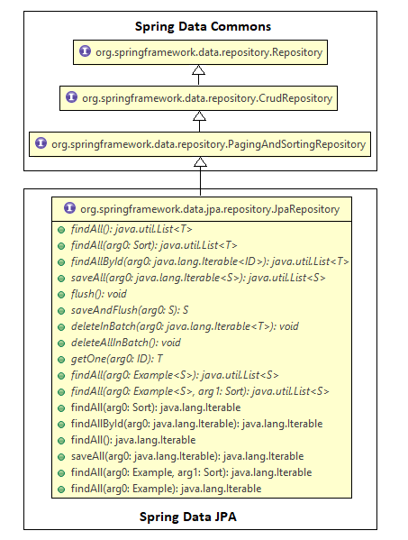

## Spring Data

>`Spring Data` is a framework that allows you write persistence layer fast`

- high level project of Spring
- it's objective is to unify and ease the access to different types of data access technologies
- supports relational and non-relatonal databases
- simplifies data access layer by removing the repository (DAO) implementation from you application

 

### Repositories

- provided by Spring Data
- interfaces associated with entities
- provide methods for CRUD operations
- Spring automatically generates the implementation class for these interfaces
- to use them define your own repository class and extend a Spring Data Repository


```java
public CustomerRepository extends CrudRepository<Customer, Integer> {}

```
- `CrudRepository` is provided by Spring Data
- accepts parameter for:
    - entity class
    - data type of the identifier attribute of the entity class
- provides methods to perform DB operations
- how it works:
    - Spring Data automatically generates the implementation class at runtime
    - provides default implementation of methods of CrudRepository interface for CustomerRepository Class.


You can directly use CustomerRepository in your Service class:
```java
public class CustomerServiceImpl implements CustomerService{

  @Autowired
  CustomerRepository customerRepository; 

  // add customer details
  public void addCustomer(Customer customer){
      customerRepository.save(customer);
  }
  // ...
}
```

 

### Spring Data Repository Interfaces

#### Spring Data Commons

Contains technology independent interfaces that support common DB opeartions.


#### `Repository<T, ID> Interface`

- core interface of Spring Data Commons
- any class that interacts with a DB has to implement it
- takes the entity class and the data type of its identifier as parameters

 

#### `CrudRepository<T, ID> Interface`

- extends `Repository Interface`
- provides methods for basic CRUD operations
- to use create an interface that extends i
- no need for implementation class it will be automatically generated at runtime

 

Important CrudRepository Methods
- `Iterable findAll()`
- `boolean existsById()`
- `Optional findById()`
- `T save(T entity)`
- `void deleteById(ID id)`
- `Iterable saveAll(Iterable entities)`
- `void deleteAll()`
- `void delete(T entity)`

<br>

`@Transactional`
- all CudRepository methods are `@Transactional` by default
- to override default setting override the method in your repositorty interface and annotate it with @Transactional with the desired attributes.


 ## PostgreSQL
 > PostreSQL is an object-based relational database management system.


 `pom.xml`

 ```java

 <dependency>

           <groupId>org.postgresql</groupId>

           <artifactId>postgresql</artifactId>

           <version>42.2.8</version>

       </dependency>

```

`application.properties`

```java

spring.datasource.url=jdbc:postgresql://localhost:5432/postgres

spring.datasource.username=postgres

spring.datasource.password=postgres

```

 

## MongoDB

> MongoDB is a document-oriented database that stores data in JSON format.

 

`pom.xml`

```java

<dependency>

<groupId>org.springframework.boot</groupId>

<artifactId>spring-boot-starter-data-mongodb</artifactId>

</dependency>

```

 

`application.properties`

```java

spring.data.mongodb.uri=mongodb://localhost:27017/customer_db

```

 

How to use:

- mark classes with `@Document`

- create Repository interface by extending `MongoRepository` interface


## Using Queries in Spring Data


### Createing queries by method name

To allow for custom queries not provided by `CrudRepository` you can add methods to your Repository Interface, and Spring Data automatically generates the JPQL query based on the name of the method.

 

### @Query

For creating complex queries.

 

#### Select with @Query

Add method to your Repository interface:

```java

public interface CustomerRepository extends CrudRepository<Customer, Integer> {

    //JPQL query

    @Query("SELECT c.name FROM Customer c WHERE c.emailId = :emailId")

    // method to find Name by email

    String findNameByEmailId(@Param("emailId") String emailId);

 

    // OR

 

    public interface CustomerRepository extends CrudRepository<Customer, Integer> {

        @Query("SELECT c.name FROM Customer c WHERE c.emailId = ?1")

        String findNameByEmailId(String emailId);

    }

 

}

```

 

#### Insert, Update & Delete queries

 

Must use:

- @Query

- @Modifying

- @Transactional

 

```java

public interface CustomerRespository extends CrudRepository<Customer, Integer> {

    @Query("UPDATE Customer c SET c.emailId = :emailId WHERE c.customerId = :customerId")

    @Modifying

    @Transactional

    Integer updateCustomerEmailId(@Param("emailId") String updateCustomerByEmailId, @Param("customerId") Integer customerId);

}

```

`@Modifying` marks the method for non-select query

 

### @NamedQuery

 

To set up custom queries you can:
```java
@Entity
@Table(name="customer")
@NamedQuery(name="Customer.findNameByEmailId", query="SELECT c.name FROM Customer c WHERE c.emailId = :emailId")

public class Customer {

    @Id
    private Integer customerId;
    private String emailId;
    private String name;
    private LocalDate dateOfBirth;
    @Enumerated(value=EnumType.STRING)
    private CustomerType customerType;
    // ....
}
```
The `name` attribute should be ClassName.methodName.

In your repository interface add the method:
```java
public interface CustomerRespository extends CrudRepository<Customer, Integer>{
    String findNameByEmailId(@Param("emailId") String emailId);

}
```

## PagingAndSortingRepositorty Interface

 

## Spring Data JPA
> Sub project of Spring Data, makes it easy to connect with relatonal databases.
- extends Spring Data repositories
- provides `JpaRepository Interface`
- provides `JpaScpecificationExecutor Interface`
    - not a repository
    - provides methods that are used to fetch entities from DB using `JPA Criteria API`




### Derived Query Methods

[Baeldung - Derived Querys](https://www.baeldung.com/spring-data-derived-queries)

```java
List<User> findByName(String name);
```


## Pagination

