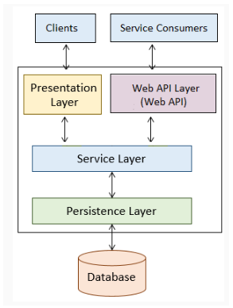
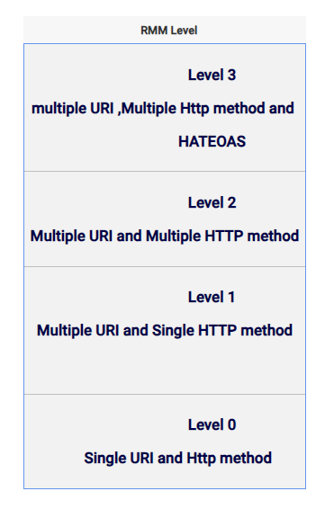

web-services, rest, soap

# Web Services
> Web service is a standard way of communication between web applications running on diverse platforms and frameworks.

# REST (Respresentational State Transfer)

- Type of web Service following REST principles.

- For REST everything is a resource identified by URI (Uniform Resource Identifier).

## Rest Principles
- **Uniform Interface**
    - everyting is a resource
    - resources are identified by URI (Uniform Resource Indentifier)
    - resources are manipulated by HTTP methods
- **Stateless**
    - each request is independent
    - contains all information necessary
- **Client-Server**
- **Cashable**
    - Cashe-Control Headers are used to optimize cashing
- **Layered System**

## Richardson Maturity Model (RMM)

### HATEOS
Hypermedia as the Engine of Application State

>HATEOAS provides responses with links to related resources and controls which tells service client what to do next.