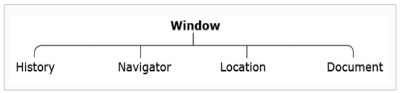
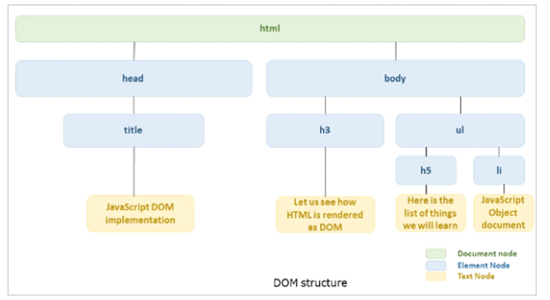

js, javaScript, BOM, Browser-Object-Model

# JS Browser Object Model
> Built in browser objects that allow js to programatically control the browser.

## BOM Hierarcy
Root Object: `Window`

Window consists of:
- `History`
- `Navigator`
- `Location`
- `Document`



## Document Object
> The HTML webpage is represented by the `Document` Object.

- the object considers the web page as a tree (= `Document Object Model`)
- each `node` of the tree represents an HTML element of the page as `element object`
- the `attributes` of the HTML element becomes the `properties` of the element object
- `WC3` provides the `DOM API` that has properties and methods to help traverse and manipulate the HTML page



### DOM API Methods

#### Accessing Elements

`document.getElementById();`
```html
<p id="p1">Paragraph1</p>
<script>
    document.getElementById('p1');
</script>
```

The following methods returning a `NodeList` (list of HTML elements)
- `document.getElementsByTagName('h1')`
- `document.getElementsByClassName(className)`
    - find element(s) by the value of the class attribute
- `document.querySelectorAll()`
    - find element(s) by CSS selector

```html
<p class="blue">Paragraph</p>
<script>
    var x = document.querySelectorAll('p.blue');
    x[0].innerHtml; 
</script>
```

