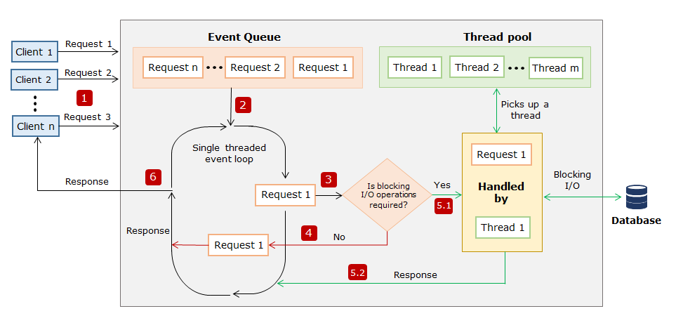

# Node Single Threade Event Loop Model

## Steps of the Event Loop Model

### 1. Event Queue

Node puts all incoming request in a queue called `Event Queue`.

### 2. Event Loop

- internal component of the Node web server
- it is an infinite loop
- receives requests and processes them
- uses a single thread to process the requests

### 3. Event Loop Checks for Requests
- the `Event Loop` keeps checking the `Event Queue` for requests
- if there are request it takes one and starts to process it

### 4. Event Loop checks Request for I/O Operation
- if the request does NOT have an I/O operation
    - it gets processed
    - and response is returned to client

### 5. Processing I/O Operations

#### 5.1 checking Internal Thread Pool availability
Event Loop checks the availability of thread from the `internal thread pool`

#### 5.2 I/O Operation is processed
- a thread from the internal thread pool is assigned to handle I/O operation
- internal thread will processes the request an preforms the I/O operation
- `Event Loop` goes on to process the next request in the `Event Queue`

### 6. Send response to requests with I/O operations
- after internal thread processed the request 
- it creates a response
- sends response back to the `Event Loop`
- `Event Loop` send response to client
