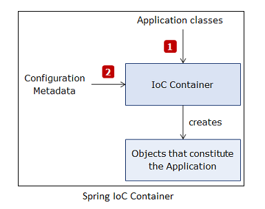

spring, java, ioc, inversion-of-control, dependency-injection

# Spring Framework

## Why use Spring in project?
Dependency Injection.
- provides loose coupling, more flexible
- easier to test

> `Dependency Injection` is a technique where an external framework is responsible for creating, assembling and wiring the dependencies.

> `Inversion of Control` means the control over creating, wiring and assembling an object no longer resides with the dependent classes themselves but with a `Dependency Injection Framework` also called `IoC Containers`


Spring framework is one of the Dependency Injection Frameworks avaialble.


## Advantages of the Spring Framework


## Spring IoC Container
> The `IoC Container` creates, initialized and injects the required objects. The life cycle of these objects are managed by Spring. They are called `Beans`.


Spring needs information about these objects, their classes, how to wire them together. 

`Configuration metadata` provides this information. It can provide it in the following ways:
- XML configuration
- Java-based configuration
- Java Annotation based configuration


Spring IoC Container reads application classes, and the configuration metadata to create and wire beans.



### Spring IoC Container Interfaces

#### `BeanFactory Interface`

- using its `getBean()` method you can get instances of beans
- beans are only initiated only when asked be the client by calling `getBean()`

#### `Application Context Interface`
- it initiates all beans when the container is loaded
- commonly used implementation of the interface
    - `ClassPathXmlApplicationContext` processes XML based configuration data
    - `AnnotationConfigApplicationContext` processes Java based configuration metadata


## Java based Configuration Metadata

Java based configuration metadata is provided in a Java class using the following annotation:
- `@Configuraion` identifies the class as a configuration class
- `@Bean` declares a bean
    - by default only one instance is created (singleton)
    - by default the name of the bean is the name of the method it is configured
    - that can be changed by adding `@Bean(name="newName")`

```java
@Configuration
public class SpringConfig {

    @Bean
    public CustomerLoginService customerLoginService() {
        return  new CustomerLoginServiceImpl(customerLoginRepository());
    }

    @Bean(name="customerRepository")
    public CustomerLoginRepository customerLoginRepository() {
        return new CustomerLoginRepositoryImpl();
    }

}
``` 

## Java Annotation Based Configuration
No need the for a configuration class, Spring automatically 
detects and intitiates the beans through component scanning.

However scanning is NOT enabled by default, you have to use the `@ComponentScan` annotation to enable component scanning.
```java
@Configuration
@ComponentScan
public class SpringConfig {
}
```

It looks for classes annotated with:
<br><i> (the 4 stereotype annotation)</i>
- `@Component` marks a Spring bean (general purpose)
- `@Service` defines a service layer spring bean
- `@Repository` defines a persistent layer spring bean
- `@Controller`defines a web component for the presentation layer


The name of the bean by default is the name of the class just lowercase. To change that use the `value` attribute.
```java
​@Repository(value="customerLogin")
public class CustomerLoginRepositoryImpl implements CustomerLoginRepository {	
	// ...
}
```

Best Practices
- Use specialised annotation over generic
- Annotate classes not interfaces (class implementing an interface does not inherit the annotations)


### Using annotation based configuration

#### Add dependecy to `POM.xml`

`pom.xml`
```java
<dependencies>
    <dependency>
        <groupId>org.springframework</groupId>
        <artifactId>spring-context</artifactId>
        <version>6.0.10</version>
    </dependency>
</dependencies>
```

#### Create bean
Regular java class that you plan to inject as dependency later:

`SpringBean.java`
```java

```
```java
// load context
ApplicationContext ctx = new AnnotationConfigApplicationContext(SpringConfig.class);


// accessing beans
// by class
UserService userService = ctx.getBean(CustomerLoginServiceImpl.class);
// OR
// by the name of the method it is configured
UserService userService = (UserService) ctx.getBean("customerLoginServiceImpl");
```

## Autowiring
- dependency injection without a configuration file
- `@Autowired` annotation can be directly applied to constructors, attributes, setter methods
- Spring uses Java `Reflection API` to perform dependency injection

In the example below
```java
public class CustomerLoginServiceImpl implements CustomerLoginService {
	@Autowired
	private CustomerLoginRepository customerLoginRepository;
	
    //... 
}
```
Spring will search for the class that implements CustomerLoginRepository interface and injects its object.

- if no such bean is found it throws a `NoSuchBeanDefinitionException` exception
- if more than one is found, it throws an exception indicating that


To handle the case when more than one bean exists:
```java
public class CustomerLoginServiceImpl implements CustomerLoginService {
	@Autowired
    @Qualifier("jdbcRepository")
	private CustomerLoginRepository customerLoginRepository;
```
the `@Qualifier` specifies that the bean registered to the container named "jdbcRepository" 
