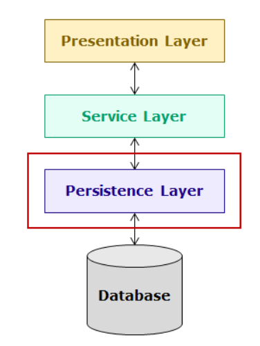

# Spring Boot Application

## Application Layers

### Persistence Layer
- code to interact with the database are implemented in this layer
- uses
    - Spring ORM
    - Spring Data
    - Spring JDBC

## Application Code Layers/Folders/Key Features
- entity
    - @Entity
    - @Id
    - @Column

- dto
    - extends CrudRepository<EntityName, PrimaryKeyType>
- service
    - @Service
    - @Trasactional
- controller