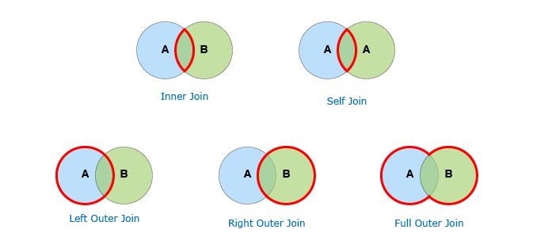

sql, joins, 
# SQL Joins
> Joins can combine data from multiple tables.



#### Inner

`INNER JOIN` restricts records retrieval from Table1 and Table2 to those that satisfy the join requirement.

```sql
SELECT *
FROM Employees E INNER JOIN Computer C ON E.compId = C.compID 
WHERE department = "Finance";

-- is the same as

SELECT *
FROM Employees E INNER JOIN Computer C ON E.compId = C.compID 
AND department = "Finance";
```

## LEFT OUTER JOIN

`LEFT OUTER JOIN` returns all records from the left table, and the records that match the condition from the right table.

## RIGHT OUTER JOIN

`RIGHT OUTER JOIN` returns all records from the right table, and the records that match the condition from the left table.

## FULL OUTER JOIN

Returns matched as well as unmatched rows from both table.

Example:
Employees table has data about computers employees use, some do not use any. (id, name, compid)
Computers table has all computers, even if they are not assigned to any employees.
We would like to have a list of all the employees and all the computers. (compid, model)

```sql
SELECT id, name, E.compid, C.compid, model
FROM Employee E FULL OUTER JOIN Computers C ON E.compid = C.compid;
```


## CROSS JOIN

`CROSS JOIN`, alse refered to as `Cartesian Product`, combines each row of Table1 with each row of Table2.

Question:
Table1 has 10 rows and 5 columns, Table2 has 0 rows and 7 columns. How many rows T1 Cross Join T2 would have?

Answer:0

## Self Join uses INNER JOIN

`SELF JOIN` is an SQL statement which is used to intersect or join a table in the database to itself.

Example:
Employees Table
- id
- name
- manager (employee id of manager)

Creta quiry that lists all employees and there managers
```sql
SELECT EMP.id, EMP.name, MGR.name
FROM Employees EMP INNER JOIN Employees MGR on EMP.manager = MGR.id;
```


## Questions
> Describe what a join is and explain the different types of joins we can create.