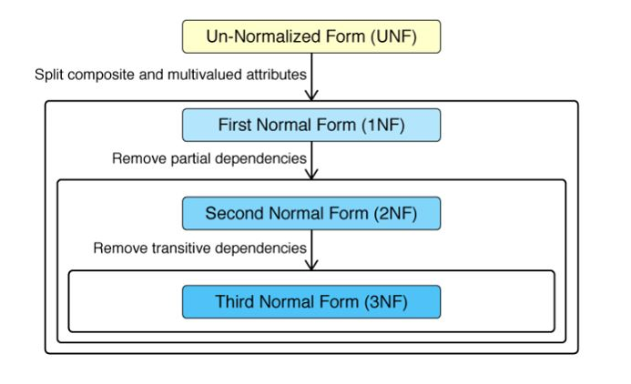

sql, normalization

# Normalization
> What is normalization?

`Normalization` is the process of reorganizing data in a database to ensure that:
- there is no redundancy of data
- data dependencies are logical 

## Functional Dependency
> Relation between two or more attributes

Types:
- fully functional
    - A -> B 
    - each A determines exactly 1 B
    - A can be composite
    - A - determinant
    - B - dependent
- partial functional dependency
    - {A, B} -> C if C is only dependent on B, not A
- transitive functional dependency
    - A -> B -> C 
    - C is transitionally dependent on A

Anomaly
> Anomalies are unexpected side affects from trying to insert, update or delete a row.

Improperly defined functional dependencies can lead to anomalies

## Normal Forms

- `1NF` First Normal Form

  - Each table cell should contain a single value.
  - Each record needs to be unique
  - violation example: hobbies with several values
  - solution add new rows with each value

- `2NF` Second Normal Form

  - Be in 1NF
  - Single Column Primary Key - that does not functionally dependant on any subset of candidate key relation
  - violation example: name and address identifies a record when two different people have the same name
  - solution: add a primary key column

- `3NF` Third Normal Form

  - in 2NF
  - all the attributes (e.g. database columns) are functionally dependent on solely the primary key (no transitive functional dependencies)
  - violation example: hospital database having a table of patients which included a column for the telephone number of their doctor. The phone number is dependent on the doctor, rather than the patient, thus would be better stored in a table of doctors
  - solution: create table for doctors and store phone number there

- BCNF Boyce-Codd Normal Form
  - in 3NF
  - for any dependency A → B, A should be a super key. which means that A should be a non-key attribute if B is a key attribute
  - for every Functional Dependency, LHS is the super key - ???????????????
  - no dependency and lossless join - ??????????????????
